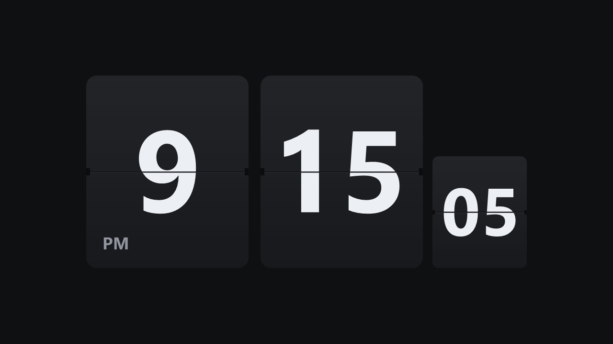
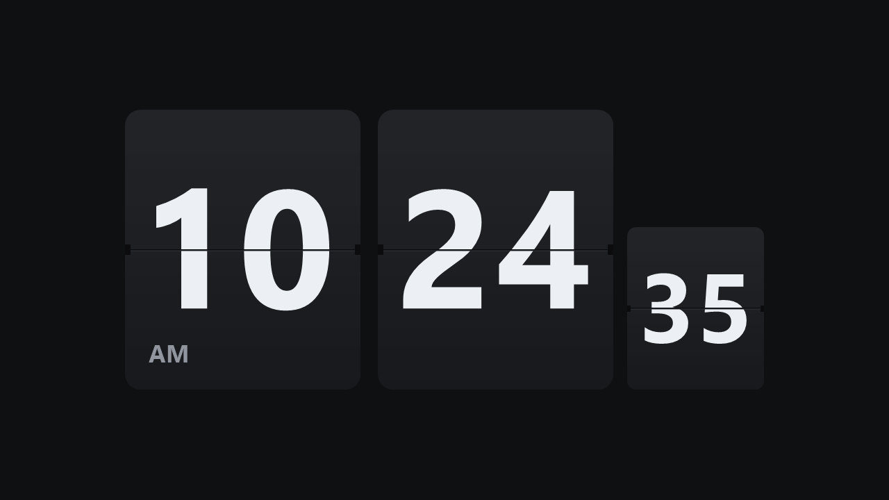
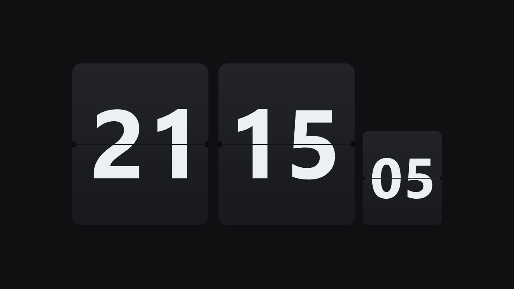

# Flip Clock Screensaver

[](README.md)
[-000000.svg?logo=apple&logoColor=white)](README.md)
[-0078D6.svg?logo=windows&logoColor=white)](README.md)
[](README.md)
[](LICENSE)

A lightweight, elegant flip-clock screensaver inspired by classic retro mechanical split-flap clocks and Fliqlo. Available natively on both **Windows** (pure C# / WinForms / GDI+) and **macOS** (native Swift / AppKit `ScreenSaver.framework`), it requires zero external runtimes or heavy Chromium wrappers, running smoothly at 60 FPS on any modern machine.

---

### 🕒 12-Hour Mode (with AM / PM Indicator)


<details>
<summary><b>Click to view more screenshots (12-Hour AM & 24-Hour Mode)</b></summary>

#### 12-Hour Mode (AM)


#### 24-Hour Mode


</details>

---

## ✨ Features

- **Mechanical Split-Flap Animation:**
  - Real-time 60 FPS 3D perspective folding flap simulation.
  - Dynamic lighting shading: folding flaps darken as they rotate away from light, with realistic drop shadows cast on the resting lower card.
  - Authentic hardware details including the horizontal divider groove, bevel highlight, and axle hinge notches on card borders.
- **Hours, Minutes & Seconds Display:**
  - Standard **Hours** and **Minutes** cards.
  - Optional retro compact **Seconds** card anchored to the bottom baseline.
  - Perfectly proportioned typography with mathematical vertical bisection across the split line.
- **Crystal-Clear Typography (High-DPI / Retina Aware):**
  - Rendered via vector geometric outlines using native system fonts (`SF Pro` / `Segoe UI` / `Arial`).
  - Native display scaling on 1080p, 1440p, 4K Retina, 5K, and Apple XDR displays with zero blurry bitmap stretching.
- **Configurable Settings:**
  - Toggle between **12-Hour** (with optional **AM/PM** indicator) and **24-Hour** time formats.
  - Toggle the **Seconds card** on/off.
  - Interactive **Clock Scale** slider to size the clock from compact to room-filling.
  - Preferences persist across reboots (`HKCU\Software\FliqloClockCS` on Windows, `ScreenSaverDefaults` on macOS).
- **Native OS Protocol Compliance:**
  - **Windows (`.scr`):** Full support for standard switches (`/s`, `/c`, `/p`, `/w`) with safe mouse dismissal grace period.
  - **macOS (`.saver`):** Universal 2 binary bundle for Apple Silicon (M1/M2/M3/M4) and Intel Macs with native AppKit configuration sheet in System Settings.

---

## 🚀 Installation & Usage

### 🍎 macOS Installation (`.saver`)

1. Download `FliqloClock-macOS.saver.zip` from [Releases](https://github.com/LuC-9/flip-clock-screensaver/releases) (or build from source).
2. Unzip and double-click `FliqloClock.saver` to install into your macOS Screen Savers.
   * *Alternatively, move `FliqloClock.saver` manually into `~/Library/Screen Savers/` (current user) or `/Library/Screen Savers/` (all users).*
3. Open macOS **System Settings** > **Wallpaper / Screen Saver**, select **FliqloClock**, and set your idle timeout.
4. Click **Options** to customize 24-hour mode, AM/PM label, seconds card, and clock scale.

> [!TIP]
> **macOS Gatekeeper Note:** If macOS displays a message saying the screensaver cannot be opened because it is from an unidentified developer, right-click `FliqloClock.saver` in Finder, hold `Option`, and select **Open** (or run `xattr -d com.apple.quarantine ~/Library/Screen\ Savers/FliqloClock.saver` in Terminal).

---

### 🪟 Windows Installation (`.scr`)

#### Method 1: Install as Windows Screensaver
1. Download or compile `FliqloClock.scr`.
2. Right-click `FliqloClock.scr` in File Explorer and select **Install**.
   * *Alternatively, copy `FliqloClock.scr` to `C:\Windows\System32\` or `C:\Windows\`.*
3. Open Windows **Screen Saver Settings**, select **FliqloClock**, and adjust your wait time.
4. Click **Settings** to customize format, scale, and seconds visibility.

#### Method 2: Run Directly / Standalone Mode
You can run the clock directly on Windows without installing it:

```powershell
# Run in fullscreen screensaver mode
.\FliqloClock.scr /s

# Run in standalone windowed mode (press ESC to exit, 'S' for settings)
.\FliqloClock.scr /w

# Open configuration dialog
.\FliqloClock.scr /c
```

---

## 🛠️ Building from Source

### Building on macOS
Requires Xcode or Xcode Command Line Tools installed on macOS 11.0+:

```bash
cd macos
chmod +x build.sh
./build.sh
```

The script compiles a universal 2 binary (`arm64` + `x86_64`) and produces:
* `macos/build/FliqloClock.saver`
* `macos/build/FliqloClock-macOS.saver.zip`

### Building on Windows
No Visual Studio installation is required! The project builds using Microsoft's built-in C# compiler (`csc.exe`) included with Windows and .NET Framework.

```powershell
.\build.ps1
```

```text
Found 64-bit C# Compiler at: C:\Windows\Microsoft.NET\Framework64\v4.0.30319\csc.exe
Compiling files: Program.cs, Settings.cs, SettingsForm.cs, FlipCard.cs, ScreensaverForm.cs...
Build Succeeded! Output: .\FliqloClock.scr
```

---

## 📂 Project Architecture

### 🪟 Windows Implementation
| File | Description |
| :--- | :--- |
| [`Program.cs`](Program.cs) | Application entry point, Per-Monitor DPI awareness initialization, and command-line argument routing (`/s`, `/c`, `/p`, `/w`). |
| [`ScreensaverForm.cs`](ScreensaverForm.cs) | Fullscreen and windowed canvas, 60 FPS animation timer, 200ms time check, input event handlers, and multi-card layout engine. |
| [`FlipCard.cs`](FlipCard.cs) | Split-flap rendering engine: 3D rotational perspective math, lighting shadows, rounded rectangle clipping, and vector typography centering. |
| [`Settings.cs`](Settings.cs) | Data model for user preferences with persistent Windows Registry serialization (`HKCU\Software\FliqloClockCS`). |
| [`SettingsForm.cs`](SettingsForm.cs) | Windows Forms dialog UI for configuring 24-hour mode, AM/PM, seconds display, and scale slider. |
| [`build.ps1`](build.ps1) | Standalone build automation script targeting .NET 4.0/4.8 `csc.exe`. |

### 🍎 macOS Implementation
| File | Description |
| :--- | :--- |
| [`macos/Sources/FliqloClockView.swift`](macos/Sources/FliqloClockView.swift) | Main `ScreenSaverView` subclass, 60 FPS frame callback, display geometry and multi-card auto-centering layout engine. |
| [`macos/Sources/FlipCardView.swift`](macos/Sources/FlipCardView.swift) | Native CoreGraphics 3D perspective folding flap engine, darkening lighting gradients, drop shadows, axle hinge notches, and vector typography bisection. |
| [`macos/Sources/Settings.swift`](macos/Sources/Settings.swift) | Preferences data model persisted via `ScreenSaverDefaults` for isolated macOS screensaver processes. |
| [`macos/Sources/SettingsViewController.swift`](macos/Sources/SettingsViewController.swift) | Native AppKit modal configuration sheet (`hasConfigureSheet`) for options panel in System Settings. |
| [`macos/Info.plist`](macos/Info.plist) | Screensaver bundle manifest declaring `NSPrincipalClass`, bundle identifier, and minimum system version. |
| [`macos/FliqloClock.xcodeproj`](macos/FliqloClock.xcodeproj) | Xcode project definition targeting Universal Binary (`arm64` + `x86_64`) `FliqloClock.saver`. |
| [`macos/build.sh`](macos/build.sh) | Command-line build automation script producing distribution `.saver.zip`. |

### 🚀 CI / CD Pipeline
| File | Description |
| :--- | :--- |
| [`.github/workflows/build.yml`](.github/workflows/build.yml) | Multi-platform GitHub Actions workflow automating Windows and macOS matrix builds and release asset attachments. |

---

## ⚙️ Configuration Options

| Option | Default | Description |
| :--- | :---: | :--- |
| **24-Hour Clock** | `true` | Switch between 24-hour (`21:15:05`) and 12-hour (`09:15:05`) modes. |
| **Show AM/PM** | `true` | Displays "AM" or "PM" in the bottom-left corner of the hours card when in 12-hour mode. |
| **Show Seconds Card** | `true` | Displays the compact seconds card anchored next to the minutes card. |
| **Clock Scale** | `1.0` | Adjusts overall card scale from 0.5x to 1.5x (up to 2.0x) to fit your preference. |

---

## 📄 License

This project is licensed under the [MIT License](LICENSE).

