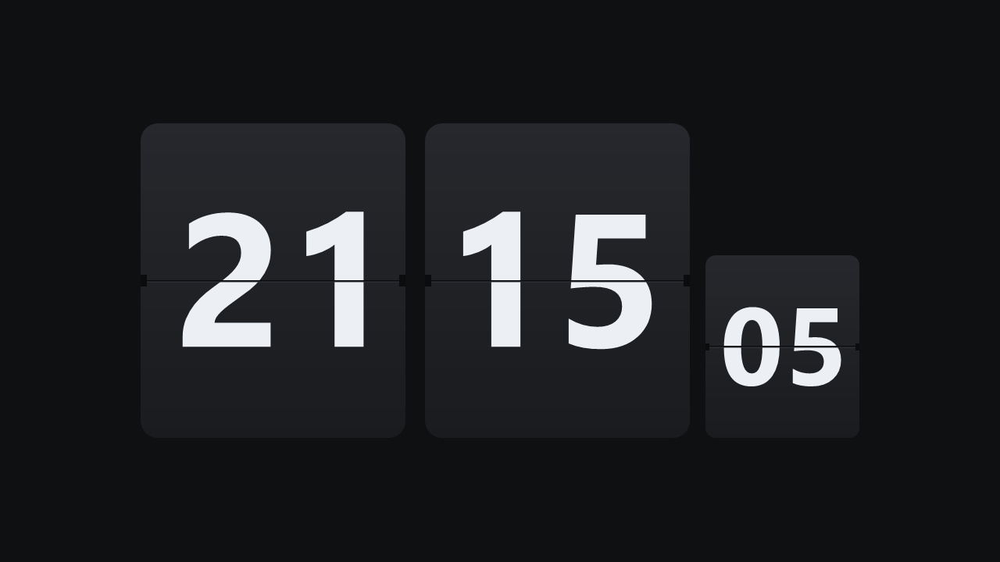

# Flip Clock Screensaver

[](https://microsoft.com/windows)
[](https://dotnet.microsoft.com/)
[](https://docs.microsoft.com/dotnet/csharp/)
[](LICENSE)

A lightweight, elegant Windows flip-clock screensaver inspired by classic retro mechanical split-flap clocks and Fliqlo. Written in pure C# with Windows Forms and GDI+, it requires zero external runtimes or heavy Chromium wrappers, running natively and smoothly on any modern Windows machine.

---



---

## ✨ Features

- **Mechanical Split-Flap Animation:**
  - Real-time 60 FPS 3D perspective folding flap simulation.
  - Dynamic lighting shading: folding flaps darken as they rotate away from light, with realistic drop shadows cast on the resting lower card.
  - Authentic hardware details including the horizontal divider groove, bevel highlight, and axle hinge notches on card borders.
- **Hours, Minutes & Seconds Display:**
  - Standard **Hours** and **Minutes** cards.
  - Optional retro compact **Seconds** card anchored to the bottom baseline.
  - Perfectly proportioned typography with mathematical vertical bisection across the split line.
- **Crystal-Clear Typography (High-DPI Aware):**
  - Rendered via GDI+ vector geometric outlines (`GraphicsPath`) using native system fonts (`Segoe UI` / `Arial`).
  - Per-Monitor DPI aware (`SetProcessDpiAwareness`) — razor-sharp rendering on 1080p, 1440p, and 4K+ displays with zero blurry bitmap stretching.
- **Configurable Settings:**
  - Toggle between **12-Hour** (with optional **AM/PM** indicator) and **24-Hour** time formats.
  - Toggle the **Seconds card** on/off.
  - Interactive **Clock Scale** slider to size the clock from compact to room-filling.
  - Settings are persisted in the Windows Registry (`HKCU\Software\FliqloClockCS`).
- **Standard Screensaver Protocol Compliance:**
  - Full support for standard Windows command-line switches:
    - `/s` — Fullscreen screensaver execution.
    - `/c` or `/c:<HWND>` — Configuration settings modal.
    - `/p <HWND>` — Live preview embedded directly inside the Windows Screensaver Control Panel.
    - `/w` — Standalone windowed mode for easy desktop testing.
- **Safe Mouse Dismissal:**
  - 1,500ms startup grace period and a 60px movement threshold to prevent accidental exits from bumping your desk or vibration.
  - Guaranteed mouse cursor restoration on exit.

---

## 🚀 Installation & Usage

### Method 1: Install as Windows Screensaver
1. Download or compile `FliqloClock.scr`.
2. Right-click `FliqloClock.scr` in File Explorer and select **Install**.
   - *Alternatively, copy `FliqloClock.scr` to `C:\Windows\System32\` or `C:\Windows\`.*
3. Open Windows **Screen Saver Settings**, select **FliqloClock**, and adjust your wait time.
4. Click **Settings** to customize format, scale, and seconds visibility.

### Method 2: Run Directly / Standalone Mode
You can run the clock directly without installing it:

```powershell
# Run in fullscreen screensaver mode
.\FliqloClock.scr /s

# Run in standalone windowed mode (press ESC to exit, 'S' for settings)
.\FliqloClock.scr /w

# Open configuration dialog
.\FliqloClock.scr /c
```

---

## 🛠️ Building from Source

No Visual Studio installation is required! The project builds using Microsoft's built-in C# compiler (`csc.exe`) included with Windows and .NET Framework.

### Prerequisites
- Windows 10 or Windows 11
- PowerShell 5.1+

### Build Instructions
Run the provided build script from PowerShell:

```powershell
.\build.ps1
```

The script will locate the 64-bit .NET Framework compiler and compile `FliqloClock.scr` directly into the project directory:

```text
Found 64-bit C# Compiler at: C:\Windows\Microsoft.NET\Framework64\v4.0.30319\csc.exe
Compiling files: Program.cs, Settings.cs, SettingsForm.cs, FlipCard.cs, ScreensaverForm.cs...
Build Succeeded! Output: .\FliqloClock.scr
```

---

## 📂 Project Architecture

| File | Description |
| :--- | :--- |
| [`Program.cs`](Program.cs) | Application entry point, Per-Monitor DPI awareness initialization, and command-line argument routing (`/s`, `/c`, `/p`, `/w`). |
| [`ScreensaverForm.cs`](ScreensaverForm.cs) | Fullscreen and windowed canvas, 60 FPS animation timer, 200ms time check, input event handlers, and multi-card layout engine. |
| [`FlipCard.cs`](FlipCard.cs) | Split-flap rendering engine: 3D rotational perspective math, lighting shadows, rounded rectangle clipping, and vector typography centering. |
| [`Settings.cs`](Settings.cs) | Data model for user preferences with persistent Windows Registry serialization (`HKCU\Software\FliqloClockCS`). |
| [`SettingsForm.cs`](SettingsForm.cs) | Windows Forms dialog UI for configuring 24-hour mode, AM/PM, seconds display, and scale slider. |
| [`build.ps1`](build.ps1) | Standalone build automation script targeting .NET 4.0/4.8 `csc.exe`. |

---

## ⚙️ Configuration Options

| Option | Default | Description |
| :--- | :---: | :--- |
| **24-Hour Clock** | `true` | Switch between 24-hour (`21:15:05`) and 12-hour (`09:15:05`) modes. |
| **Show AM/PM** | `true` | Displays "AM" or "PM" in the bottom-left corner of the hours card when in 12-hour mode. |
| **Show Seconds Card** | `true` | Displays the compact seconds card anchored next to the minutes card. |
| **Clock Scale** | `1.0` | Adjusts overall card scale from 0.5x to 2.0x to fit your preference. |

---

## 📄 License

This project is licensed under the [MIT License](LICENSE).
